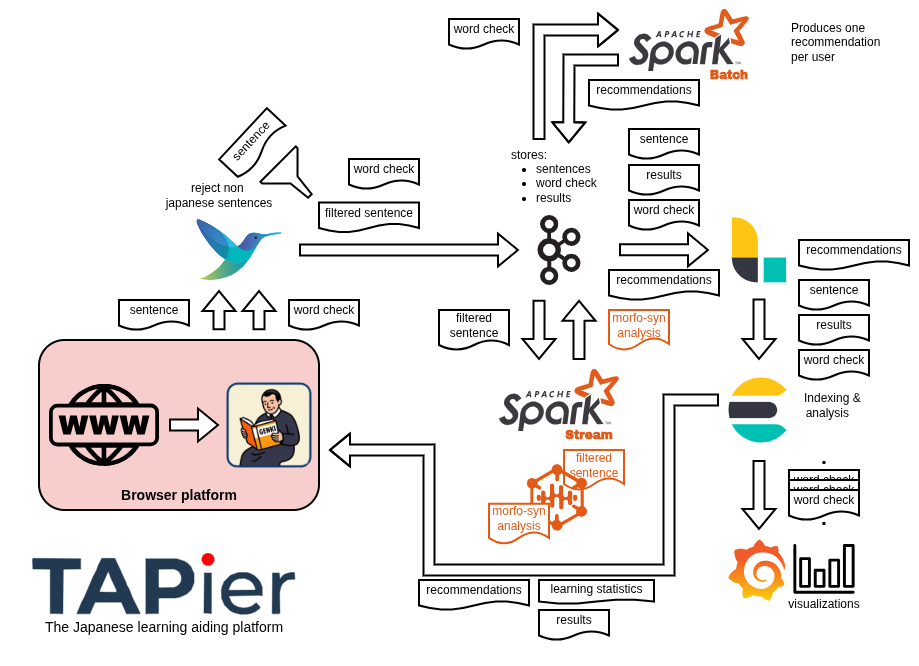

## How to setup

First bring the backend stack up from the project root. The `--build` flag is only needed on the first run. The `kafka-init` helper service creates the Kafka topics and then exits on its own.

```bash
docker compose up --build -d
```

Once the services are up (`docker compose ps` to check), install the extension manually by activating developer options in your Chromium based browser. Select Load Unpacked and click select after having moved to `./tapier_mv3_extension/src`

## Quick Dashboards

- Grafana: http://localhost:3000/ ([dashboard](http://localhost:3000/goto/bfq0bzu2r5ou8a?orgId=1))

## Architecture



## Components

### TAPier Manifest V3 extension

A browser extension was found to be the most convenient data producer for the task at hand. It sends down the data pipeline the sentence to be examined and it awaits the resulting atomization of the sentence. When a word is individually checked a message is sent to inform that that user as, at least momentarily forgotten if ignorant to  that word.

> There was a tough of having a page in which the user could insert his immersion media of choice. The extension is more convenient for the user and easier to implement

The extension also provides although primitive visualization of the most searched words by the users and the most searched grammar components. It additionally surfaces personalized recommendations, the words a user is most likely to need next, fetched from ElasticSearch by a pseudonymous per-user id and shown in the same word grid. In the future a feature to export these lists into a spaced repetition software or to implement a flashcard section to the extension itself.

### Fluent Bit

Fluent Bit has been chosen as the ingestion service as the filtering that is to be performed is simple but not found in the pre-made filters. The choice of a light service that provides the possibility to implement easily custom filters made sense. 

The main filter is implemented in `fluentbit/clean.lua`, this filter block requests that do not contain any Japanese characters. This is done to remove what would be additional load to Spark and to not store useless data in Kafka.

### Kafka

Helped in setup up by a small throwaway image, it set ups the four topics used in the demo: `sentences`, `result`, `word_checks` and `recommendations`

### Spark

Spark performs stream processing on the sentences it reads from Kafka `sentences` topic. It applies to each sentence a morphological analysis through `fugashi`, a Python binding over the [MeCab](https://taku910.github.io/mecab/) analyzer that is loaded once per worker to avoid paying the dictionary load on every row. Each sentence is broken into its atomic tokens, surface, dictionary lemma, reading, part of speech and conjugation, and inflected verbs and adjectives are merged with their trailing endings into single phrase atoms. The atomized result is written back to the `result` topic.

Besides this streaming analyzer, Spark runs a periodic batch job: a Spark MLlib ALS recommender that reads the accumulated `word_checks`, learns which words each user tends to forget, and writes a per-user list to the `recommendations` topic. It shares the streaming job's image and is triggered on a timer by Ofelia, so recommendations appear once the first run has completed.

### Logstash

Logstash is the bridge between Kafka and ElasticSearch. It runs as a plain shipper with no filtering. Three independent pipelines move the streams to their own indices: `sentence-results` carries the `result` topic into the `sentence_results` index keyed by sentence id, so each sentence is one document the extension can look up; `word-checks` carries the `word_checks` topic into the `word_checks` index with no document id, so every check accumulates as its own event for counting; and `recommendations` carries the `recommendations` topic into the `recommendations` index keyed by user id, so each training run overwrites a user's current list.

### ElasticSearch

ElasticSearch is where the data lands and is queried. The extension polls `sentence_results` by id to retrieve the atomization of a submitted sentence, `word_checks` is aggregated to surface the most searched words and grammar points, and `recommendations` is read by the extension by user id to show each learner their suggested words. The aggregated fields are mapped as `keyword` so grouping happens on exact terms instead of analyzed text.

### Grafana

Grafana serves the quick dashboards at `http://localhost:3000/`. It reads the `word_checks` index from ElasticSearch and visualizes the aggregations — most searched words and most searched grammar components — the same data the extension exposes in its primitive in-panel view.

## Inspecting the pipeline
Each stage can be tapped from the terminal to see what is passing through it. Service names follow `docker-compose.yml`; adjust them if yours differ.

**Fluent Bit:** every record that survives the `clean.lua` filter is logged as it is forwarded:

```bash
docker compose logs -f fluentbit
```

**Kafka:** consume a topic directly to read the raw messages at that hop:

```bash
docker compose exec kafka-1 /opt/kafka/bin/kafka-console-consumer.sh \
  --bootstrap-server kafka-1:29092 --topic sentences --from-beginning
```
Swap `sentences` for `result`, `word_checks` or `recommendations` to watch the other topics, and list them all with:
```bash
docker compose exec kafka-1 /opt/kafka/bin/kafka-topics.sh \
  --bootstrap-server kafka-1:29092 --list
```
The topic Spark writes to must match the name you consume here; confirm it is the same `result`/`results` spelling on both sides, or the consumer prints nothing.

**Spark:** the streaming query prints per-batch progress and any analysis errors:

```bash
docker compose logs -f spark
```
The recommender is a separate batch job; run it on demand and watch its output with:
```bash
docker compose run --rm spark-train
```

**Logstash:** the three pipelines carry a `stdout { codec => rubydebug }`, so every document is printed as it is shipped onward:

```bash
docker compose logs -f logstash
```

**ElasticSearch:** check what actually landed: doc counts per index, then a sample document:

```bash
curl 'localhost:9200/_cat/indices?v'
curl 'localhost:9200/word_checks/_search?pretty&size=1'
curl 'localhost:9200/sentence_results/_search?pretty&size=1'
curl 'localhost:9200/recommendations/_search?pretty&size=1'
```
